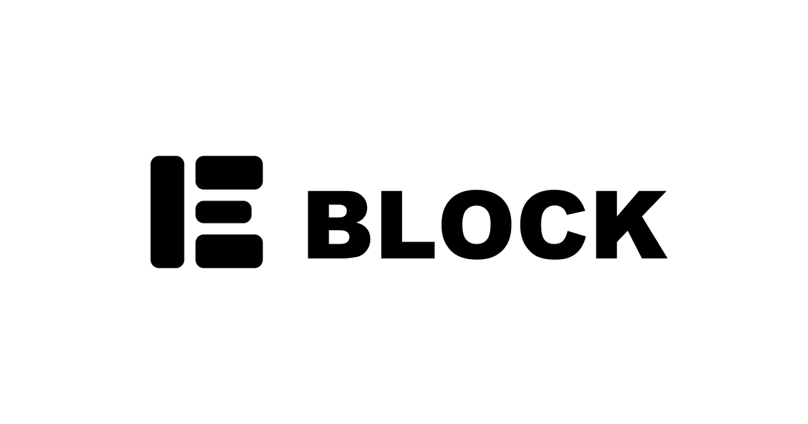

# BLOCK - Markup Engineer Portfolio

[https://block.i-kinako.com](https://block.i-kinako.com)


**BLOCK** is a personal portfolio website designed with a "Bento Grid" layout.
It embodies the concept of "Structuring the Web" — focusing on solid HTML structure, semantic markup, and maintainable CSS architecture.

## 🛠 Tech Stack


- **Framework:** [Astro](https://astro.build/) (v5)
- **Styling:** SCSS (Sass) with CSS Modules & CSS Layers (`@layer`)
- **Scripting:** TypeScript
- **Animation:** GSAP, Lenis (Smooth Scroll)
- **Icons:** React Icons
- **Deployment:** Cloudflare Pages

## ✨ Features

- **Bento Grid Layout:** Responsive grid system using CSS Grid `dense` flow.
- **CSS Architecture:** strict management using `@layer` (reset, base, layout, component, utility) to control cascade.
- **Performance:** Static Site Generation (SSG) for high performance and SEO.
- **Micro-interactions:** Subtle animations and hover effects using CSS and GSAP.

## 🧞 Commands

All commands are run from the root of the project, from a terminal:

| Command            | Action                                       |
| :----------------- | :------------------------------------------- |
| `npm install`      | Installs dependencies                        |
| `npm run dev`      | Starts local dev server at `localhost:4321`  |
| `npm run build`    | Build your production site to `./dist/`      |
| `npm run preview`  | Preview your build locally, before deploying |
| `npm run lint:fix` | Run ESLint & Stylelint                       |

## 📂 Project Structure

```text
/
├── public/          # Static assets (images, fonts, favicon)
├── src/
│   ├── assets/      # Processed assets
│   ├── components/  # Astro components
│   │   ├── blocks/  # Bento grid blocks (Hero, Work, Tech...)
│   │   └── ui/      # UI components (Card, Logo...)
│   ├── layouts/     # Page layouts
│   ├── pages/       # Routing
│   └── styles/      # Global styles & SCSS configuration
│       ├── foundation/ # Mixins, Variables, Layers
│       └── ...
└── astro.config.mjs
```
